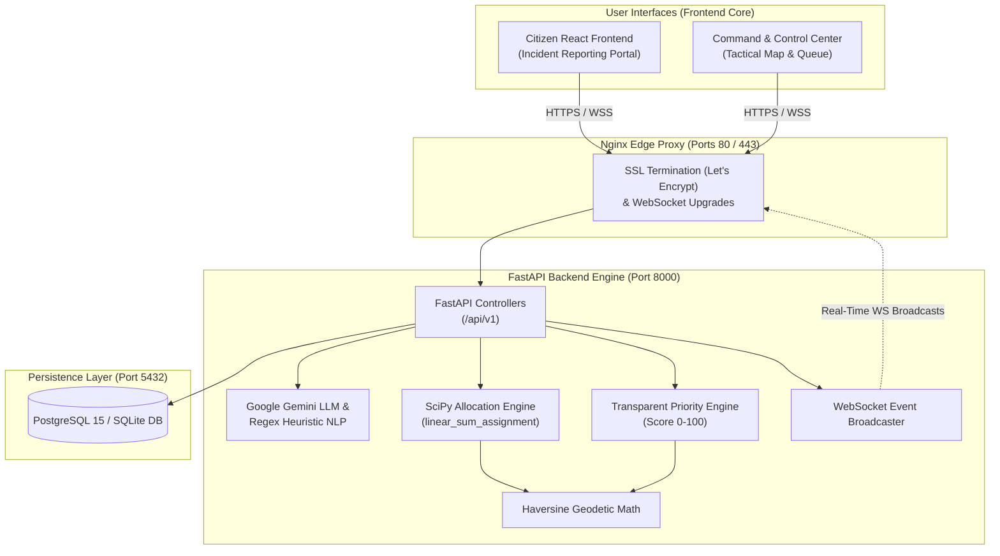

# 🛡️ DRISHTi: Real-Time Disaster Early-Warning & Resource Coordination Platform

[](https://disasterresponse.click)
[](https://disasterresponse.click)
[](https://github.com/smit45-m/Disaster-response-platform/actions)
[](https://aws.amazon.com)
[](https://fastapi.tiangolo.com)
[](https://react.dev)

**DRISHTi** is an intelligent, end-to-end disaster-response decision-support platform designed specifically for **Rourkela, Odisha, India**. It converts unstructured citizen incident reports into structured AI intelligence, calculates a transparent 0–100 priority score, computes Haversine distance matrices, executes SciPy Hungarian bipartite resource matching, streams real-time updates via WebSockets, and provides interactive GIS command dashboards for emergency responders.

---

## 🌐 Live Services & Deployment Links

| Service / Resource | Access URL | Description & Status |
|---|---|---|
| 🔒 **Official Production Web App** | **[https://disasterresponse.click](https://disasterresponse.click)** | 🟢 Active (Let's Encrypt TLS 1.3 / SSL Padlock Verified) |
| 🌐 **WWW Domain Access** | **[https://www.disasterresponse.click](https://www.disasterresponse.click)** | 🟢 Active (Secure Reverse Proxy Endpoint) |
| 📑 **Interactive Swagger API Docs** | **[https://disasterresponse.click/docs](https://disasterresponse.click/docs)** | 🟢 Live OpenAPI REST & WebSocket Explorer |
| 🔒 **Cloudflare Edge Tunnel Mirror** | **[https://therefore-pointing-downtown-save.trycloudflare.com](https://therefore-pointing-downtown-save.trycloudflare.com)** | 🟢 Active (Cloudflare Edge CDN Mirror) |
| 🌐 **AWS EC2 Direct IPv4** | **[http://13.204.160.135](http://13.204.160.135)** | 🟢 AWS `ap-south-1` (Mumbai Instance) |

---

## 📂 Detailed Repository & Project Folder Structure

Below is the complete architectural layout of the **Disaster Response Platform** codebase:

```text
Disaster-response-platform/
├── 📄 README.md                        # Primary project overview, documentation & deployment guide
├── 📄 docker-compose.yml               # Local development multi-container orchestration (SQLite)
├── 📄 docker-compose.prod.yml          # Production multi-container orchestration (PostgreSQL + Nginx + Cloudflare)
├── 📄 .env                             # Environment variables & configuration settings
├── 📄 .gitignore                       # Git exclusion rules
│
├── 📁 backend/                         # FastAPI Backend Application Engine
│   ├── 📄 Dockerfile                   # Docker image specification for FastAPI application
│   ├── 📄 requirements.txt             # Python dependencies (FastAPI, SQLAlchemy, SciPy, Google GenAI, etc.)
│   ├── 📄 disaster_response.db         # Local SQLite database (development mode)
│   └── 📁 app/                         # Core FastAPI Core Module
│       ├── 📄 main.py                  # Application entry point, middleware, routes & WebSocket handlers
│       ├── 📄 config.py                # System settings and environment variable bindings
│       ├── 📁 ai/                      # AI & Natural Language Processing
│       │   └── 📄 gemini_service.py    # Google Gemini LLM extractor with regex heuristic fallback
│       ├── 📁 allocation/              # Optimization & Resource Matching Algorithms
│       │   └── 📄 matching_engine.py   # SciPy linear_sum_assignment Hungarian bipartite matcher
│       ├── 📁 scoring/                 # Priority Scoring Engine
│       │   └── 📄 priority_engine.py   # 5-factor weighted priority score calculator & Haversine math
│       ├── 📁 core/                    # Core Real-Time Utilities
│       │   └── 📄 websocket.py         # Real-time WebSocket connection manager & event broadcaster
│       ├── 📁 database/                # Database Abstraction & Models
│       │   ├── 📄 database.py          # SQLAlchemy DB engine & session initialization
│       │   ├── 📄 models.py            # ORM models (Incident, Resource, DisasterAlert, Assignment, etc.)
│       │   └── 📄 schemas.py           # Pydantic schemas for data validation and serialization
│       ├── 📁 routes/                  # API Endpoint Controllers (/api/v1)
│       │   ├── 📄 incidents.py         # Incident reporting, triage, and filtering endpoints
│       │   ├── 📄 resources.py         # Emergency resource management endpoints
│       │   ├── 📄 assignments.py       # SciPy match run, confirm, dispatch & lifecycle endpoints
│       │   ├── 📄 alerts.py            # Early warning disaster alert management endpoints
│       │   ├── 📄 facilities.py        # Critical facility & shelter locator endpoints
│       │   ├── 📄 audit.py             # System activity audit trail logging
│       │   ├── 📄 demo.py              # Synthetic dataset seeder & state reset controllers
│       │   └── 📄 extra_features.py    # Offline SMS/IVR simulation & weather telemetry
│       └── 📁 tests/                   # Automated Pytest Suite
│           ├── 📄 test_api_workflows.py# End-to-end incident reporting to dispatch test
│           ├── 📄 test_nlp_fallback.py # Fallback NLP parser unit tests
│           ├── 📄 test_priority_engine.py # Priority scoring mathematical model tests
│           └── 📄 test_scipy_optimizer.py # Resource matching algorithm unit tests
│
├── 📁 frontend/                        # React 18 + Vite Single-Page Web Application
│   ├── 📄 Dockerfile                   # Development container definition
│   ├── 📄 Dockerfile.prod              # Production multi-stage build (Vite -> Nginx)
│   ├── 📄 nginx.conf                   # Frontend SPA route proxy configuration
│   ├── 📄 package.json                 # Frontend dependencies (React, Leaflet, Three.js, Motion, Tailwind)
│   ├── 📄 vite.config.js               # Vite build tool and proxy configuration
│   ├── 📄 tailwind.config.js           # Tailwind CSS theme and styling configuration
│   ├── 📄 index.html                   # HTML entry template
│   └── 📁 src/                         # React Application Source Code
│       ├── 📄 App.jsx                  # Main component layout, state management & tab router
│       ├── 📄 main.jsx                 # React root renderer
│       ├── 📄 index.css                # Global CSS styles & glassmorphism components
│       ├── 📁 services/                # API Client Layer
│       │   └── 📄 api.js               # Axios HTTP client configuration & backend request wrappers
│       ├── 📁 hooks/                   # Custom React Hooks
│       │   └── 📄 useMotionPreference.js# Motion accessibility preference listener
│       └── 📁 components/              # Interactive React Components
│           ├── 📄 LandingHero.jsx      # Top hero banner, emergency status indicators & fast alert chips
│           ├── 📄 CitizenForm.jsx      # Natural language incident reporting wizard with live AI feedback
│           ├── 📄 IncidentQueue.jsx    # Real-time incident triage queue with filter controls & detail modals
│           ├── 📄 SciPyMatcher.jsx     # Interactive resource allocation dashboard & execution trigger
│           ├── 📄 MapView.jsx          # Interactive Leaflet & 3D GIS tactical map visualization
│           ├── 📄 AgenticWorkflow.jsx  # Interactive visualization of system workflow steps
│           ├── 📄 AIPipelineInspector.jsx # Deep-dive viewer for AI extraction & JSON breakdown
│           ├── 📄 DisasterChatbot.jsx  # Interactive assistant for disaster response guidance
│           ├── 📄 SmsIvrSimulator.jsx  # Offline SMS / USSD / IVR simulation interface
│           ├── 📄 WeatherRiskPredictor.jsx # Weather telemetry & flood/cyclone risk assessment
│           ├── 📄 ShelterMedicalDirectory.jsx # Safe shelter & medical facility locator map
│           ├── 📄 OfflineEmergencyInfo.jsx # Offline emergency guidance & helpline directory
│           ├── 📄 Navbar.jsx           # Top header navigation bar with active tab indicators
│           └── 📄 SystemArchitecture.jsx # Architecture diagram viewer & component guide
│
├── 📁 nginx/                           # Reverse Proxy & SSL Configuration
│   ├── 📄 nginx.conf                   # Main reverse proxy, rate limiting, and SSL configuration
│   └── 📁 certs/                       # TLS / Let's Encrypt certificate mounting path
│
├── 📁 scripts/                         # Deployment & Automation Scripts
│   ├── 📄 deploy.sh                    # Linux / macOS bash production setup script
│   └── 📄 deploy.ps1                   # Windows PowerShell deployment script
│
├── 📁 terraform/                       # Infrastructure as Code (IaC)
│   ├── 📄 main.tf                      # AWS provider initialization
│   ├── 📄 ec2.tf                       # AWS EC2 instance, Elastic IP & user-data provisioning
│   ├── 📄 iam.tf                       # IAM policies and execution roles
│   ├── 📄 security_groups.tf           # Network firewall rules (Ports 80, 443, 22, 8000, 5173)
│   ├── 📄 variables.tf                 # Terraform variable declarations
│   ├── 📄 outputs.tf                   # Deployment outputs (Public IPv4, DNS records)
│   └── 📄 terraform.tfvars.example     # Sample environment configuration file
│
└── 📁 .github/                         # GitHub Automation Workflows
    └── 📁 workflows/
        ├── 📄 deploy.yml               # Automated CI/CD build, test & AWS EC2 deployment pipeline
        └── 📄 sync-upstream.yml        # Repository synchronization automation
```

---

## 🏗️ System Architecture & Data Flow



### Architectural Data Flow Steps:
1. **Citizen Incident Submission**: A user submits a plain-text report (e.g., *"Flash flood near Sector 5, 8 people trapped, 2 elderly"*).
2. **AI Entity Extraction**: FastAPI forwards the text to `gemini_service.py`. Google Gemini extracts structured data (`people_affected`, `vulnerable_people`, `severity`, `hazard_type`). If the API is unavailable, the heuristic regex parser processes the input gracefully.
3. **Priority Score Calculation**: `priority_engine.py` calculates a deterministic score $P \in [0, 100]$ using severity, affected count, vulnerable status, nearest critical facility distance, resource proximity, and elapsed time.
4. **Hungarian Bipartite Allocation**: When dispatching resources, `matching_engine.py` builds an incident-by-resource cost matrix with Haversine distance, priority weighting, capability matching, and capacity penalties, running `scipy.optimize.linear_sum_assignment`.
5. **Real-time Synchronization**: State changes are written to the database and broadcast instantly to all connected command dashboards via WebSockets (`/api/v1/ws`).

---

## ⚡ Key Modules & Feature Mechanics

### 1. 🤖 Gemini AI NLP & Heuristic Fallback Engine
- Extracts emergency attributes from raw, unstructured Indian English / regional incident reports.
- Extracts: `incident_type`, `people_affected`, `vulnerable_people`, `severity`, `location_name`, `urgency`.
- **Fault-Tolerant Fallback**: If `GEMINI_API_KEY` is not provided or network failure occurs, the internal regex fallback engine parses keyword patterns without failing the report.

### 2. 📊 Deterministic Priority Scoring Model
The priority score $P \in [0, 100]$ is computed transparently using five weighted components:

$$P = 0.35 \times C_{\text{severity}} + 0.25 \times C_{\text{people}} + 0.15 \times C_{\text{facility}} + 0.15 \times C_{\text{resource}} + 0.10 \times C_{\text{time}}$$

#### Component Breakdown:
- **Severity ($C_{\text{severity}}$)**: `LOW` = 25, `MEDIUM` = 50, `HIGH` = 80, `CRITICAL` = 100. *(Vulnerability Promotion: If vulnerable individuals are present and severity < HIGH, severity is automatically promoted by one enum tier).*
- **People Affected ($C_{\text{people}}$)**: 0 $\rightarrow$ 0; 1 $\rightarrow$ 20; 2–5 $\rightarrow$ 40; 6–10 $\rightarrow$ 65; 11–25 $\rightarrow$ 85; 26+ $\rightarrow$ 100 (+10 pts if vulnerable people present, capped at 100).
- **Facility Proximity ($C_{\text{facility}}$)**: $\max(0, 100 - (\text{dist}_{\text{km}} / 20) \times 100)$ to nearest active critical facility (hospital, shelter, fire station).
- **Resource Availability ($C_{\text{resource}}$)**: Proximity score based on distance to closest available compatible resource.
- **Time Elapsed ($C_{\text{time}}$)**: $\min(100, (\text{elapsed\_minutes} / 180) \times 100)$.

#### Priority Tiers:
- 🔴 **HIGH PRIORITY**: $70 - 100$
- 🟡 **MEDIUM PRIORITY**: $40 - 69$
- 🟢 **LOW PRIORITY**: $0 - 39$

---

### 3. ⚙️ SciPy Hungarian Bipartite Resource Matcher
Global multi-incident resource allocation solves the Minimum Weight Bipartite Matching problem using `scipy.optimize.linear_sum_assignment`:

$$\text{Cost}_{i, j} = \text{Distance}_{\text{km}} + 0.75 \times (100 - P_i) + \text{Penalty}_{\text{capability}} + \text{Penalty}_{\text{capacity}}$$

- **Capability Penalty**: `0` for direct match, `35` for valid secondary fallback, `1,000,000` for incompatible pairings.
- **Priority Bias**: High-priority incidents ($P_i \ge 70$) heavily discount cost, prioritizing closer resources for critical emergency sites.
- **Transactional State Management**: Previewing optimization allows decision-makers to inspect distance, ETA, and cost matrix prior to triggering `/api/v1/assignments/confirm`.

---

## 🔌 Complete REST & WebSocket API Reference

All endpoints are hosted under the `/api/v1` namespace (with legacy `/api` backward compatibility).

### 🚨 Incident Management (`/api/v1/incidents`)
| Method | Endpoint | Description |
|---|---|---|
| `POST` | `/api/v1/incidents` | Submit raw report, run AI NLP extraction, score priority, and broadcast |
| `GET` | `/api/v1/incidents` | Fetch all incidents (supports filtering by `status`, `district`, `priority_category`) |
| `GET` | `/api/v1/incidents/{id}` | Get detailed record for a specific incident |
| `PATCH` | `/api/v1/incidents/{id}/status` | Manually update incident status (`REPORTED`, `VERIFIED`, `ASSIGNED`, `RESOLVED`) |

### 🚒 Emergency Resources (`/api/v1/resources`)
| Method | Endpoint | Description |
|---|---|---|
| `GET` | `/api/v1/resources` | List emergency response units (Ambulance, NDRF Boat, Fire Truck, Police) |
| `POST` | `/api/v1/resources` | Register a new emergency unit |
| `PATCH` | `/api/v1/resources/{id}/status` | Update resource status (`AVAILABLE`, `RESERVED`, `BUSY`, `OFFLINE`) |

### ⚙️ Optimization & Dispatch (`/api/v1/assignments`)
| Method | Endpoint | Description |
|---|---|---|
| `POST` | `/api/v1/assignments/optimize` | Run SciPy Hungarian bipartite matching and return recommended dispatch pairs |
| `POST` | `/api/v1/assignments/confirm` | Transactionally confirm assignment, set resource `BUSY` & incident `ASSIGNED` |
| `PATCH` | `/api/v1/assignments/{id}/status` | Advance assignment lifecycle (`IN_PROGRESS`, `COMPLETED`, `CANCELLED`) |

### ⚠️ Disaster Alerts & Facilities (`/api/v1/alerts`, `/api/v1/facilities`)
| Method | Endpoint | Description |
|---|---|---|
| `GET` | `/api/v1/alerts` | Fetch active early-warning disaster alerts |
| `POST` | `/api/v1/alerts/trigger-synthetic` | Trigger a synthetic disaster alert (e.g. Flood, Cyclone) for testing |
| `GET` | `/api/v1/facilities` | List hospitals, shelters, fire stations with live occupancy stats |

### 📡 WebSockets & Extra Features (`/api/v1/ws`, `/api/v1/extra`)
| Method | Endpoint | Description |
|---|---|---|
| `WS` | `/api/v1/ws` | Real-time WebSocket event stream for incidents, alerts, and dispatches |
| `POST` | `/api/v1/extra/sms-simulate` | Simulate incoming SMS / IVR offline incident reports |
| `GET` | `/api/v1/extra/weather-risk` | Retrieve live weather telemetry & hazard risk predictions |

---

## 🛠️ Local Development & Quick Start Guide

### Prerequisites
- **Python**: 3.10+
- **Node.js**: 18+
- **Docker & Docker Compose**: (Optional, for containerized execution)

---

### Option A: Running with Docker Compose (Recommended)

To launch the full backend engine and React frontend in local development mode:

```bash
# Clone the repository
git clone https://github.com/smit45-m/Disaster-response-platform.git
cd Disaster-response-platform

# Build and launch containers
docker compose up --build
```

#### Access Endpoints:
- **Citizen React Web App**: `http://localhost:5173`
- **FastAPI Interactive Swagger Docs**: `http://localhost:8000/docs`

---

### Option B: Manual Local Setup (Without Docker)

#### 1. Setup & Run Backend

```bash
# Navigate to backend directory
cd backend

# Create and activate virtual environment
python3 -m venv venv
source venv/bin/activate    # On Windows: venv\Scripts\activate

# Install dependencies
pip install -r requirements.txt

# Start FastAPI development server
uvicorn app.main:app --host 0.0.0.0 --port 8000 --reload
```

#### 2. Setup & Run Frontend

```bash
# Navigate to frontend directory
cd frontend

# Install Node modules
npm install

# Run Vite dev server
npm run dev
```

---

## 🚀 Production AWS Deployment Guide

The platform is configured for automated cloud deployment on **AWS EC2 (Mumbai `ap-south-1`)** using **Terraform** and **Docker Compose Prod**.

```text
[Internet Client] ---> [Cloudflare CDN Edge] ---> [AWS Security Group (80/443)]
                                                         │
                                               [Nginx Reverse Proxy]
                                                         │
                                        ┌────────────────┴────────────────┐
                                        ▼                                 ▼
                               [React Static SPA]                [FastAPI Container]
                                                                          │
                                                                 [PostgreSQL 15 DB]
```

### Deploying Infrastructure with Terraform

```bash
cd terraform

# Initialize Terraform AWS Provider
terraform init

# Plan & Review Resources
terraform plan

# Apply Infrastructure Provisioning
terraform apply -auto-approve
```

---

## 🧪 Testing & Automated Quality Assurance

The codebase features comprehensive unit and integration test coverage.

### Running Backend Unit & Integration Tests

```bash
cd backend
PYTHONPATH=. pytest app/tests/ -v
```

#### Test Suite Coverage:
- `test_api_workflows.py`: End-to-end incident submission, priority engine scoring, SciPy allocation matching, and dispatch lifecycle.
- `test_nlp_fallback.py`: Heuristic regex parser fallback validation.
- `test_priority_engine.py`: Mathematical correctness of 5-factor weighted priority score formula.
- `test_scipy_optimizer.py`: Hungarian algorithm matrix construction, distance cost calculations, and capability penalties.

### Running Frontend Production Build Verification

```bash
cd frontend
npm run build
```

---

## 🔑 Environment Variables Matrix

| Variable Name | Default Value | Description |
|---|---|---|
| `GEMINI_API_KEY` | *(Optional)* | Google Gemini API key. If omitted, heuristic regex parser is automatically activated. |
| `GEMINI_MODEL` | `gemini-2.5-flash` | Gemini model version for structured NLP extraction. |
| `DATABASE_URL` | `sqlite:///./disaster_response.db` | Database connection URI (`postgresql://...` in production). |
| `API_BASE_URL` | `http://localhost:8000/api/v1` | Backend API URL used by frontend services. |
| `VITE_API_BASE_URL` | `/api/v1` | Frontend Vite proxy routing prefix. |
| `DEFAULT_DISTRICT` | `Rourkela` | Target regional disaster management focus district. |
| `DEFAULT_LAT` | `22.2604` | Default latitude center for GIS map. |
| `DEFAULT_LON` | `84.8536` | Default longitude center for GIS map. |

---

## 🎬 Live Hackathon Demo Walkthrough

Follow this 8-step walkthrough to demonstrate the full platform lifecycle in under 3 minutes:

1. **⚡ Trigger Early Warning Alert**: Click **TRIGGER SYNTHETIC ALERT** for *Flood Warning in Rourkela*.
2. **📢 Verify Real-time Banner**: Observe the live ticker banner updating instantly via WebSockets.
3. **📝 Submit Natural Language Incident Report**: Click sample chip:  
   *"Water level rising rapidly in Sector 5. 8 people trapped inside a home, including 2 elderly persons."*
4. **🔍 Inspect AI & Priority Score**: Verify Gemini structured extraction ($8$ people affected, vulnerable = `true`, severity = `HIGH`) and Priority Score calculation ($\ge 75$, Color: Red).
5. **🗺️ View Tactical 3D GIS Map**: Switch to the GIS Map view to locate the newly reported incident pin in Rourkela.
6. **⚙️ Run SciPy Matching Engine**: Open the **SciPy Matcher** tab and click **RUN SCIPY OPTIMIZE ALGORITHM**. Inspect the computed cost matrix, distance, ETA, and optimal unit recommendation.
7. **✅ Confirm Dispatch Assignment**: Click **CONFIRM DISPATCH**. Observe state transitions: Resource $\rightarrow$ `BUSY`, Incident $\rightarrow$ `ASSIGNED`.
8. **🏁 Complete Incident Lifecycle**: Advance assignment status to `COMPLETED`. Observe Resource returning to `AVAILABLE` and Incident state updated to `RESOLVED`.

---

## 📄 License & Contact

Developed for real-time disaster early-warning and decision support in Odisha, India.  
Designed & maintained by the **DRISHTi Platform Engineering Team**.

