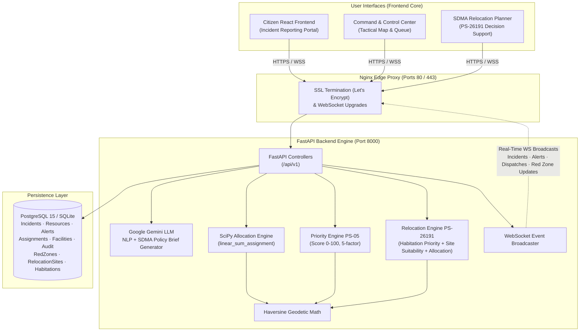

# 🛡️ DRISHTi: Real-Time Disaster Early-Warning, Resource Coordination & Proactive Relocation Platform

[](https://disasterresponse.click)
[](https://disasterresponse.click)
[](https://github.com/smit45-m/Disaster-response-platform/actions)
[](https://aws.amazon.com)
[](https://fastapi.tiangolo.com)
[](https://react.dev)
[](https://github.com/smit45-m/Disaster-response-platform)

**DRISHTi** is an intelligent, end-to-end disaster-response decision-support platform that now operates in two fully integrated modes:

1. **PS-05 — Real-Time Emergency Response**: Converts unstructured citizen incident reports into structured AI intelligence, calculates 0–100 priority scores, executes SciPy Hungarian bipartite resource matching, and streams real-time updates via WebSockets to emergency responders in Rourkela, Odisha.

2. **PS-26191 — Proactive Multi-Hazard Relocation & SDMA Decision Support** *(newly integrated)*: An AI-driven GIS platform for State Disaster Management Authorities (SDMA) that dynamically maps and updates multi-hazard Red Zones, assesses the carrying capacity of safer relocation sites, and prioritizes vulnerable habitations for proactive — not reactive — relocation planning.

---

## 🌐 Live Services & Deployment Links

| Service / Resource | Access URL | Description & Status |
|---|---|---|
| 🔒 **Official Production Web App** | **[https://disasterresponse.click](https://disasterresponse.click)** | 🟢 Active (Let's Encrypt TLS 1.3 / SSL Padlock Verified) |
| 🌐 **WWW Domain Access** | **[https://www.disasterresponse.click](https://www.disasterresponse.click)** | 🟢 Active (Secure Reverse Proxy Endpoint) |
| 📑 **Interactive Swagger API Docs** | **[https://disasterresponse.click/docs](https://disasterresponse.click/docs)** | 🟢 Live OpenAPI REST & WebSocket Explorer |
| 🔒 **Cloudflare Edge Tunnel Mirror** | **[https://therefore-pointing-downtown-save.trycloudflare.com](https://therefore-pointing-downtown-save.trycloudflare.com)** | 🟢 Active (Cloudflare Edge CDN Mirror) |
| 🌐 **AWS EC2 Direct IPv4** | **[http://13.204.160.135](http://13.204.160.135)** | 🟢 AWS `ap-south-1` (Mumbai Instance) |

---

## 📋 Feature Change Summary (PS-26191 Integration)

### ✅ Features Added / Updated

| Category | Feature | Description |
|---|---|---|
| 🗺️ **Map (GIS)** | Multi-Hazard Red Zone Overlays | Color-coded map pins: 🔴 RED ZONE (pulsing), 🚨 IMMEDIATE tier, ⚡ SHORT-TERM tier, 📅 MEDIUM-TERM tier, 🛡️ SAFE SITE — all visible on the tactical Leaflet map |
| 🗺️ **Map (GIS)** | Relocation Layer Integration | MapView now accepts `redZones`, `relocationSites`, and `habitations` props; renders complete PS-26191 overlay alongside existing incident/resource markers |
| 🧠 **New Frontend Tab** | Relocation Planner (`relocation` tab) | Fully new dashboard: Red Zone cards with intensity sliders, habitation priority queue (tier-filtered), safe site carrying capacity bars, AI SDMA policy brief generator, carrying capacity allocator, and authority weight configurator |
| 🤖 **AI** | SDMA Policy Brief Generator | Gemini AI generates actionable State Disaster Management Authority policy reports with relocation timelines, at-risk population counts, and prioritized habitation lists |
| 🔌 **Backend API** | Relocation Module (`/api/v1/relocation`) | 9 new REST endpoints: Red Zones (CRUD + intensity update), Relocation Sites (CRUD), Habitations (CRUD), bulk prioritization engine, carrying-capacity allocation optimizer, SDMA policy report generator |
| 🗄️ **Database** | `RedZone` ORM Model | New table `red_zones`: hazard type, intensity (0–100), risk level (CRITICAL_RED / HIGH_RISK / MODERATE_WARNING), polygon GeoJSON, population at risk, disaster history |
| 🗄️ **Database** | `RelocationSite` ORM Model | New table `relocation_sites`: elevation, slope, soil stability index, distance from Red Zone, infrastructure score, max capacity, current occupancy, computed suitability score |
| 🗄️ **Database** | `VulnerableHabitation` ORM Model | New table `vulnerable_habitations`: population, children/elderly counts, poverty index, housing type (Kutcha/Semi-Pucca/Pucca), disaster history count, relocation tier (IMMEDIATE / SHORT_TERM / MEDIUM_TERM), priority score |
| ⚙️ **Scoring Engine** | `relocation_engine.py` (new) | Multi-hazard scoring engine with: `calculate_habitation_priority()` (4-factor weighted formula), `calculate_site_suitability()` (5-factor site scorer), `optimize_relocation_allocation()` (greedy capacity-aware matcher) |
| 📡 **WebSocket** | Red Zone Real-Time Events | `RED_ZONE_CREATED` and `RED_ZONE_INTENSITY_UPDATED` broadcast to all connected dashboards instantly |
| 🗄️ **Database** | `AuditEvent` extended | `entity_type` now includes `RedZone` and `RelocationSite` alongside existing types |
| 📊 **Schemas** | PS-26191 Pydantic schemas | New schemas: `RedZoneCreate`, `RedZoneResponse`, `RelocationSiteCreate`, `RelocationSiteResponse`, `VulnerableHabitationCreate`, `VulnerableHabitationResponse`, `SDMAPolicyReportRequest` |
| 🔗 **API Client** | `relocationService` in `api.js` | New frontend API service with: `getRedZones()`, `getSites()`, `getHabitations()`, `updateRedZoneIntensity()`, `allocateCarryingCapacity()`, `generateSDMAReport()` |
| 🏠 **App State** | Global relocation state in `App.jsx` | `redZones`, `relocationSites`, `habitations` state polled every 5s and passed as props to `MapView` and `RelocationPlanner`; WebSocket refresh included |

### ❌ Features Removed

| Feature | Reason |
|---|---|
| `AgenticWorkflow.jsx` as standalone top-level navigation tab | The agentic workflow visualization is retained in the codebase but removed as a primary navbar tab entry; its simulation concepts are incorporated into the Relocation Planner's demo workflow |

> **Note:** No existing PS-05 features were removed. All original incident management, resource allocation, chatbot, weather predictor, shelter directory, SMS/IVR simulator, offline emergency guide, and audit trail features remain fully intact and operational.

---

## 📂 Detailed Repository & Project Folder Structure

```text
Disaster-response-platform/
├── 📄 README.md                        # Primary project overview, documentation & deployment guide
├── 📄 docker-compose.yml               # Local development multi-container orchestration (SQLite)
├── 📄 docker-compose.prod.yml          # Production multi-container orchestration (PostgreSQL + Nginx + Cloudflare)
├── 📄 .env                             # Environment variables & configuration settings
├── 📄 .gitignore                       # Git exclusion rules
│
├── 📁 backend/                         # FastAPI Backend Application Engine
│   ├── 📄 Dockerfile                   # Docker image specification for FastAPI application
│   ├── 📄 requirements.txt             # Python dependencies (FastAPI, SQLAlchemy, SciPy, Google GenAI, etc.)
│   ├── 📄 disaster_response.db         # Local SQLite database (development mode)
│   └── 📁 app/                         # Core FastAPI Module
│       ├── 📄 main.py                  # Application entry point, middleware, routes & WebSocket handlers
│       ├── 📄 config.py                # System settings and environment variable bindings
│       ├── 📁 ai/                      # AI & Natural Language Processing
│       │   └── 📄 gemini_service.py    # Gemini LLM: incident NLP extractor + SDMA Policy Brief generator [UPDATED]
│       ├── 📁 allocation/              # Optimization & Resource Matching Algorithms
│       │   └── 📄 matching_engine.py   # SciPy linear_sum_assignment Hungarian bipartite matcher
│       ├── 📁 scoring/                 # Priority Scoring Engines
│       │   ├── 📄 priority_engine.py   # 5-factor weighted priority score + Haversine math (PS-05)
│       │   └── 📄 relocation_engine.py # [NEW] Multi-hazard habitation priority + site suitability + allocation (PS-26191)
│       ├── 📁 core/                    # Core Real-Time Utilities
│       │   └── 📄 websocket.py         # Real-time WebSocket connection manager & event broadcaster
│       ├── 📁 database/                # Database Abstraction & Models
│       │   ├── 📄 database.py          # SQLAlchemy DB engine & session initialization
│       │   ├── 📄 models.py            # ORM models: Incident, Resource, DisasterAlert, CriticalFacility,
│       │   │                           #   Assignment, AuditEvent, RedZone [NEW], RelocationSite [NEW],
│       │   │                           #   VulnerableHabitation [NEW]
│       │   └── 📄 schemas.py           # Pydantic schemas for all models + new PS-26191 schemas [UPDATED]
│       ├── 📁 routes/                  # API Endpoint Controllers (/api/v1)
│       │   ├── 📄 incidents.py         # Incident reporting, triage, and filtering endpoints
│       │   ├── 📄 resources.py         # Emergency resource management endpoints
│       │   ├── 📄 assignments.py       # SciPy match run, confirm, dispatch & lifecycle endpoints
│       │   ├── 📄 alerts.py            # Early warning disaster alert management endpoints
│       │   ├── 📄 facilities.py        # Critical facility & shelter locator endpoints
│       │   ├── 📄 audit.py             # System activity audit trail logging
│       │   ├── 📄 demo.py              # Synthetic dataset seeder & state reset controllers
│       │   ├── 📄 extra_features.py    # Offline SMS/IVR simulation & weather telemetry
│       │   └── 📄 relocation.py        # [NEW] Red Zone, Relocation Site, Habitation & SDMA Policy endpoints
│       └── 📁 tests/                   # Automated Pytest Suite
│           ├── 📄 test_api_workflows.py# End-to-end incident reporting to dispatch test
│           ├── 📄 test_nlp_fallback.py # Fallback NLP parser unit tests
│           ├── 📄 test_priority_engine.py # Priority scoring mathematical model tests
│           └── 📄 test_scipy_optimizer.py # Resource matching algorithm unit tests
│
├── 📁 frontend/                        # React 18 + Vite Single-Page Web Application
│   ├── 📄 Dockerfile                   # Development container definition
│   ├── 📄 Dockerfile.prod              # Production multi-stage build (Vite → Nginx)
│   ├── 📄 nginx.conf                   # Frontend SPA route proxy configuration
│   ├── 📄 package.json                 # Frontend dependencies (React, Leaflet, Three.js, Motion, Tailwind)
│   ├── 📄 vite.config.js               # Vite build tool and proxy configuration
│   ├── 📄 tailwind.config.js           # Tailwind CSS theme and styling configuration
│   ├── 📄 index.html                   # HTML entry template
│   └── 📁 src/                         # React Application Source Code
│       ├── 📄 App.jsx                  # Main layout, global state (redZones/sites/habitations), tab router [UPDATED]
│       ├── 📄 main.jsx                 # React root renderer
│       ├── 📄 index.css                # Global CSS styles & glassmorphism components
│       ├── 📁 services/                # API Client Layer
│       │   └── 📄 api.js               # Axios HTTP client + relocationService [NEW] + setupWebSocket
│       ├── 📁 hooks/                   # Custom React Hooks
│       │   └── 📄 useMotionPreference.js# Motion accessibility preference listener
│       └── 📁 components/              # Interactive React Components
│           ├── 📄 LandingHero.jsx      # Top hero banner, emergency status indicators & fast alert chips
│           ├── 📄 CitizenForm.jsx      # Natural language incident reporting wizard with live AI feedback
│           ├── 📄 IncidentQueue.jsx    # Real-time incident triage queue with filter controls & detail modals
│           ├── 📄 SciPyMatcher.jsx     # Interactive resource allocation dashboard & execution trigger
│           ├── 📄 MapView.jsx          # [UPDATED] Leaflet GIS tactical map — renders Red Zones, Relocation
│           │                           #   Sites & Habitation tiers (IMMEDIATE/SHORT-TERM/MEDIUM-TERM) alongside
│           │                           #   existing incident, resource & facility markers
│           ├── 📄 RelocationPlanner.jsx# [NEW] Full PS-26191 SDMA Decision Support Dashboard
│           ├── 📄 AgenticWorkflow.jsx  # Visualization of agentic system workflow steps
│           ├── 📄 AIPipelineInspector.jsx # Deep-dive viewer for AI extraction & JSON breakdown
│           ├── 📄 DisasterChatbot.jsx  # Interactive AI assistant for disaster response guidance
│           ├── 📄 SmsIvrSimulator.jsx  # Offline SMS / USSD / IVR simulation interface
│           ├── 📄 WeatherRiskPredictor.jsx # Weather telemetry & flood/cyclone risk assessment
│           ├── 📄 ShelterMedicalDirectory.jsx # Safe shelter & medical facility locator
│           ├── 📄 OfflineEmergencyInfo.jsx # Offline emergency guidance & helpline directory
│           ├── 📄 Navbar.jsx           # Top header navigation bar — includes Relocation Planner tab [UPDATED]
│           └── 📄 SystemArchitecture.jsx # Architecture diagram viewer & component guide
│
├── 📁 nginx/                           # Reverse Proxy & SSL Configuration
│   ├── 📄 nginx.conf                   # Main reverse proxy, rate limiting, and SSL configuration
│   └── 📁 certs/                       # TLS / Let's Encrypt certificate mounting path
│
├── 📁 scripts/                         # Deployment & Automation Scripts
│   ├── 📄 deploy.sh                    # Linux / macOS bash production setup script
│   └── 📄 deploy.ps1                   # Windows PowerShell deployment script
│
├── 📁 terraform/                       # Infrastructure as Code (IaC)
│   ├── 📄 main.tf                      # AWS provider initialization
│   ├── 📄 ec2.tf                       # AWS EC2 instance, Elastic IP & user-data provisioning
│   ├── 📄 iam.tf                       # IAM policies and execution roles
│   ├── 📄 security_groups.tf           # Network firewall rules (Ports 80, 443, 22, 8000, 5173)
│   ├── 📄 variables.tf                 # Terraform variable declarations
│   ├── 📄 outputs.tf                   # Deployment outputs (Public IPv4, DNS records)
│   └── 📄 terraform.tfvars.example     # Sample environment configuration file
│
└── 📁 .github/                         # GitHub Automation Workflows
    └── 📁 workflows/
        ├── 📄 deploy.yml               # Automated CI/CD build, test & AWS EC2 deployment pipeline
        └── 📄 sync-upstream.yml        # Repository synchronization automation
```

---

## 🏗️ System Architecture & Data Flow


```mermaid
flowchart TD
    subgraph Clients["User Interfaces (Frontend Core)"]
        CitizenUI["Citizen React Frontend<br/>(Incident Reporting Portal)"]
        DashboardUI["Command & Control Center<br/>(Tactical Map & Queue)"]
        SDMADash["SDMA Relocation Planner<br/>(PS-26191 Decision Support)"]
    end

    subgraph NginxProxy["Nginx Edge Proxy (Ports 80 / 443)"]
        Proxy["SSL Termination (Let's Encrypt)<br/>& WebSocket Upgrades"]
    end

    subgraph BackendEngine["FastAPI Backend Engine (Port 8000)"]
        API["FastAPI Controllers<br/>(/api/v1)"]
        GeminiService["Google Gemini LLM<br/>NLP + SDMA Policy Brief Generator"]
        ScoringEngine["Priority Engine PS-05<br/>(Score 0-100, 5-factor)"]
        RelocationEngine["Relocation Engine PS-26191<br/>(Habitation Priority + Site Suitability + Allocation)"]
        SciPyOptimizer["SciPy Allocation Engine<br/>(linear_sum_assignment)"]
        HaversineMath["Haversine Geodetic Math"]
        WSManager["WebSocket Event Broadcaster"]
    end

    subgraph DatabaseStore["Persistence Layer"]
        DB[("PostgreSQL 15 / SQLite<br/>Incidents · Resources · Alerts<br/>Assignments · Facilities · Audit<br/>RedZones · RelocationSites · Habitations")]
    end

    CitizenUI -->|HTTPS / WSS| Proxy
    DashboardUI -->|HTTPS / WSS| Proxy
    SDMADash -->|HTTPS / WSS| Proxy
    Proxy --> API

    API --> GeminiService
    API --> ScoringEngine
    API --> RelocationEngine
    API --> SciPyOptimizer
    SciPyOptimizer --> HaversineMath
    ScoringEngine --> HaversineMath
    RelocationEngine --> HaversineMath

    API --> DB
    API --> WSManager
    WSManager -.->|Real-Time WS Broadcasts<br/>Incidents · Alerts · Dispatches · Red Zone Updates| Proxy
```

---

## ⚡ Key Modules & Feature Mechanics

### 1. 🤖 Gemini AI NLP & SDMA Policy Brief Engine

- **Incident NLP (PS-05)**: Extracts `incident_type`, `people_affected`, `vulnerable_people`, `severity`, `location_name`, `urgency` from raw, unstructured Indian English reports.
- **SDMA Policy Brief Generator (PS-26191)**: `generate_sdma_policy_brief()` produces a structured AI-authored State Disaster Management Authority report with at-risk population summary, prioritized habitation relocation lists, recommended site allocations, and actionable timelines.
- **Fault-Tolerant Fallback**: If `GEMINI_API_KEY` is missing or network failure occurs, the heuristic regex parser activates automatically without failing any request.

---

### 2. 📊 Deterministic Priority Scoring Model (PS-05)

The incident priority score $P \in [0, 100]$ is computed using five weighted components:

$$P = 0.35 \times C_{\text{severity}} + 0.25 \times C_{\text{people}} + 0.15 \times C_{\text{facility}} + 0.15 \times C_{\text{resource}} + 0.10 \times C_{\text{time}}$$

| Component | Description |
|---|---|
| **Severity** ($C_{\text{severity}}$) | LOW=25, MEDIUM=50, HIGH=80, CRITICAL=100 *(auto-promoted one tier if vulnerable individuals present)* |
| **People Affected** ($C_{\text{people}}$) | 0→0, 1→20, 2–5→40, 6–10→65, 11–25→85, 26+→100 (+10 if vulnerable, capped at 100) |
| **Facility Proximity** ($C_{\text{facility}}$) | `max(0, 100 − (dist_km / 20) × 100)` to nearest active critical facility |
| **Resource Availability** ($C_{\text{resource}}$) | Proximity score to closest available compatible resource unit |
| **Time Elapsed** ($C_{\text{time}}$) | `min(100, (elapsed_minutes / 180) × 100)` |

**Priority Tiers**: 🔴 HIGH (70–100) · 🟡 MEDIUM (40–69) · 🟢 LOW (0–39)

---

### 3. 🏚️ Multi-Hazard Habitation Priority Scoring (PS-26191)

$$S_{\text{hab}} = 0.35 \times F_{\text{hazard}} + 0.25 \times F_{\text{demographic}} + 0.20 \times F_{\text{history}} + 0.20 \times F_{\text{structural}}$$

| Factor | Description |
|---|---|
| **Hazard Intensity** ($F_{\text{hazard}}$) | Normalized hazard intensity (0–100) from linked Red Zone; auto-updated when zone intensity changes |
| **Demographic Vulnerability** ($F_{\text{demographic}}$) | Combined ratio of children + elderly to total population, scaled by poverty index |
| **Disaster History** ($F_{\text{history}}$) | Frequency-normalized count of past disaster events at the habitation location |
| **Structural Risk** ($F_{\text{structural}}$) | Housing type: Kutcha=100 (full risk), Semi-Pucca=60, Pucca=25 |

**Relocation Tiers**: 🚨 IMMEDIATE (score ≥ 75) · ⚡ SHORT_TERM (score 50–74) · 📅 MEDIUM_TERM (score < 50)

---

### 4. 🏗️ Relocation Site Suitability Scoring (PS-26191)

$$S_{\text{site}} = 0.25 \times E_{\text{elevation}} + 0.20 \times Sl_{\text{slope}} + 0.25 \times So_{\text{soil}} + 0.15 \times D_{\text{distance}} + 0.15 \times I_{\text{infra}}$$

| Factor | Description |
|---|---|
| **Elevation** | Normalized against safe threshold (>100 m above sea level) |
| **Slope** | Logarithmic penalty applied for slope degrees > 5° |
| **Soil Stability** | Direct 0–100 stability index |
| **Distance from Red Zone** | Inversely scored — farther from hazard = higher score |
| **Infrastructure Rating** | Composite score for roads, utilities, and emergency services |

**Status Tiers**: 🟢 OPTIMAL (> 25% capacity free) · 🟡 NEAR_CAPACITY (≤ 25%) · 🔴 FULL (≤ 5%)

---

### 5. ⚙️ SciPy Hungarian Bipartite Resource Matcher (PS-05)

$$\text{Cost}_{i, j} = \text{Distance}_{\text{km}} + 0.75 \times (100 - P_i) + \text{Penalty}_{\text{capability}} + \text{Penalty}_{\text{capacity}}$$

- **Capability Penalty**: 0 for direct capability match, 35 for valid secondary fallback, 1,000,000 for incompatible
- **Priority Bias**: High-priority incidents ($P_i \geq 70$) heavily discount cost, ensuring closest resources reach critical sites
- **Transactional Confirmation**: Preview optimization before triggering `/api/v1/assignments/confirm`

---

## 🗺️ Tactical Map Layer Legend

The **Tactical GIS Map** renders the following fully color-coded, labeled layers simultaneously:

| Icon | Color | Layer Type |
|---|---|---|
| 🔴 **RED ZONE** *(pulsing)* | Crimson `#DC2626` | Multi-Hazard Red Zones — areas unsuitable for permanent habitation |
| 🚨 **IMMEDIATE** *(pulsing)* | Bright Red `#EF4444` | Habitations requiring immediate relocation (priority ≥ 75) |
| ⚡ **SHORT-TERM** | Amber `#F59E0B` | Habitations requiring relocation within weeks (priority 50–74) |
| 📅 **MEDIUM-TERM** | Blue `#3B82F6` | Habitations requiring relocation within months (priority < 50) |
| 🛡️ **SAFE SITE** | Emerald `#10B981` | Approved safe relocation sites with carrying capacity |
| 🚑 **RESCUE** | Blue `#2563EB` | Emergency rescue resource units |
| 🏥 **FACILITY** | Purple `#8B5CF6` | Critical facilities (hospitals, shelters, fire stations) |
| 🔴 **HIGH INCIDENT** *(pulsing)* | Red `#E53E3E` | High-priority active incidents |
| 🟡 **MED INCIDENT** | Orange `#DD6B20` | Medium-priority incidents |
| 🟢 **LOW INCIDENT** | Green `#38A169` | Low-priority incidents |

---

## 🔌 Complete REST & WebSocket API Reference

All endpoints are hosted under the `/api/v1` namespace (with legacy `/api` backward compatibility).

### 🚨 Incident Management (`/api/v1/incidents`)
| Method | Endpoint | Description |
|---|---|---|
| `POST` | `/api/v1/incidents` | Submit raw report, run AI NLP extraction, score priority, and broadcast |
| `GET` | `/api/v1/incidents` | Fetch all incidents (filterable by `status`, `district`, `priority_category`) |
| `GET` | `/api/v1/incidents/{id}` | Get detailed record for a specific incident |
| `PATCH` | `/api/v1/incidents/{id}/status` | Update incident status (`REPORTED`, `VERIFIED`, `ASSIGNED`, `RESOLVED`) |

### 🚒 Emergency Resources (`/api/v1/resources`)
| Method | Endpoint | Description |
|---|---|---|
| `GET` | `/api/v1/resources` | List emergency units (Ambulance, NDRF Boat, Fire Truck, Police) |
| `POST` | `/api/v1/resources` | Register a new emergency resource unit |
| `PATCH` | `/api/v1/resources/{id}/status` | Update resource status (`AVAILABLE`, `RESERVED`, `BUSY`, `OFFLINE`) |

### ⚙️ Optimization & Dispatch (`/api/v1/assignments`)
| Method | Endpoint | Description |
|---|---|---|
| `POST` | `/api/v1/assignments/optimize` | Run SciPy Hungarian bipartite matching, return recommended dispatch pairs |
| `POST` | `/api/v1/assignments/confirm` | Transactionally confirm assignment; resource → `BUSY`, incident → `ASSIGNED` |
| `PATCH` | `/api/v1/assignments/{id}/status` | Advance lifecycle (`IN_PROGRESS`, `COMPLETED`, `CANCELLED`) |

### ⚠️ Disaster Alerts & Facilities (`/api/v1/alerts`, `/api/v1/facilities`)
| Method | Endpoint | Description |
|---|---|---|
| `GET` | `/api/v1/alerts` | Fetch active early-warning disaster alerts |
| `POST` | `/api/v1/alerts/trigger-synthetic` | Trigger a synthetic disaster alert (Flood, Cyclone, etc.) |
| `GET` | `/api/v1/facilities` | List hospitals, shelters, fire stations with live occupancy stats |

### 🔴 Multi-Hazard Red Zones (`/api/v1/relocation/red-zones`) ⭐ NEW — PS-26191
| Method | Endpoint | Description |
|---|---|---|
| `GET` | `/api/v1/relocation/red-zones` | List all Red Zones sorted by hazard intensity (filterable by `hazard_type`, `district`) |
| `POST` | `/api/v1/relocation/red-zones` | Register a new Red Zone; broadcasts `RED_ZONE_CREATED` via WebSocket |
| `PUT` | `/api/v1/relocation/red-zones/{id}/intensity` | Update hazard intensity (0–100); auto-recalculates all linked habitation priorities; broadcasts `RED_ZONE_INTENSITY_UPDATED` |

### 🏗️ Relocation Sites (`/api/v1/relocation/sites`) ⭐ NEW — PS-26191
| Method | Endpoint | Description |
|---|---|---|
| `GET` | `/api/v1/relocation/sites` | List safe relocation sites with live carrying capacity metrics and suitability scores |
| `POST` | `/api/v1/relocation/sites` | Register a new site; suitability score auto-calculated on creation |

### 🏚️ Vulnerable Habitations (`/api/v1/relocation/habitations`) ⭐ NEW — PS-26191
| Method | Endpoint | Description |
|---|---|---|
| `GET` | `/api/v1/relocation/habitations` | List habitations sorted by priority score (filterable by `tier`: IMMEDIATE / SHORT_TERM / MEDIUM_TERM) |
| `POST` | `/api/v1/relocation/habitations` | Register habitation; relocation priority score computed automatically on creation |

### 🔄 Prioritization & Allocation Engine (`/api/v1/relocation`) ⭐ NEW — PS-26191
| Method | Endpoint | Description |
|---|---|---|
| `POST` | `/api/v1/relocation/prioritize-all` | Bulk re-score all habitations against current Red Zone intensities |
| `POST` | `/api/v1/relocation/allocate-carrying-capacity` | Greedy capacity-aware optimization: match prioritized habitations to available safe sites |
| `POST` | `/api/v1/relocation/sdma-policy-report` | Generate AI-authored SDMA policy brief report via Gemini |

### 📡 WebSockets & Extra Features (`/api/v1/ws`, `/api/v1/extra`)
| Method | Endpoint | Description |
|---|---|---|
| `WS` | `/api/v1/ws` | Real-time WebSocket stream: incidents, alerts, dispatches, Red Zone updates |
| `POST` | `/api/v1/extra/sms-simulate` | Simulate incoming SMS / IVR offline incident reports |
| `GET` | `/api/v1/extra/weather-risk` | Retrieve live weather telemetry & hazard risk predictions |

---

## 🛠️ Local Development & Quick Start Guide

### Prerequisites
- **Python**: 3.10+
- **Node.js**: 18+
- **Docker & Docker Compose**: (Optional, for containerized execution)

---

### Option A: Running with Docker Compose (Recommended)

```bash
# Clone the repository
git clone https://github.com/smit45-m/Disaster-response-platform.git
cd Disaster-response-platform

# Build and launch containers
docker compose up --build
```

#### Access Endpoints:
- **React Web App**: `http://localhost:5173`
- **FastAPI Swagger Docs**: `http://localhost:8000/docs`

---

### Option B: Manual Local Setup (Without Docker)

#### 1. Setup & Run Backend

```bash
cd backend

# Create and activate virtual environment
python3 -m venv venv
source venv/bin/activate    # On Windows: venv\Scripts\activate

# Install dependencies
pip install -r requirements.txt

# Start FastAPI development server
uvicorn app.main:app --host 0.0.0.0 --port 8000 --reload
```

#### 2. Setup & Run Frontend

```bash
cd frontend

# Install Node modules
npm install

# Run Vite dev server
npm run dev
```

> On startup, the backend auto-seeds the SQLite database with synthetic Rourkela PS-05 demo data (incidents, resources, facilities, alerts) **and** PS-26191 Red Zones, Relocation Sites, and Vulnerable Habitations.

---

## 🚀 Production AWS Deployment Guide

The platform is configured for automated cloud deployment on **AWS EC2 (Mumbai `ap-south-1`)** using **Terraform** and **Docker Compose Prod**.

```text
[Internet Client] ---> [Cloudflare CDN Edge] ---> [AWS Security Group (80/443)]
                                                         │
                                                [Nginx Reverse Proxy]
                                                         │
                                        ┌────────────────┴────────────────┐
                                        ▼                                 ▼
                               [React Static SPA]                [FastAPI Container]
                                                                          │
                                                                 [PostgreSQL 15 DB]
```

### Deploying Infrastructure with Terraform

```bash
cd terraform

terraform init
terraform plan
terraform apply -auto-approve
```

---

## 🧪 Testing & Automated Quality Assurance

### Running Backend Unit & Integration Tests

```bash
cd backend
PYTHONPATH=. pytest app/tests/ -v
```

#### Test Suite Coverage:
- `test_api_workflows.py`: End-to-end incident submission → priority scoring → SciPy allocation → dispatch lifecycle.
- `test_nlp_fallback.py`: Heuristic regex parser fallback validation.
- `test_priority_engine.py`: Mathematical correctness of 5-factor weighted priority score formula.
- `test_scipy_optimizer.py`: Hungarian algorithm matrix construction, distance cost, and capability penalties.

### Running Frontend Production Build Verification

```bash
cd frontend
npm run build
```

---

## 🎬 Live Demo Walkthrough

### 🔵 PS-05 — Real-Time Emergency Response (8-Step Demo)

1. **⚡ Trigger Early Warning Alert**: Click **TRIGGER SYNTHETIC ALERT** for *Flood Warning in Rourkela*.
2. **📢 Verify Real-time Banner**: Observe the live ticker banner updating instantly via WebSockets.
3. **📝 Submit Natural Language Report**: Use sample chip — *"Water level rising in Sector 5. 8 trapped, 2 elderly."*
4. **🔍 Inspect AI & Priority Score**: Verify Gemini extraction (8 affected, vulnerable=`true`, severity=`HIGH`), Priority Score ≥ 75 (Red).
5. **🗺️ View Tactical GIS Map**: Locate incident pin, Red Zone overlays, and Safe Site markers on the map.
6. **⚙️ Run SciPy Matching Engine**: Click **RUN SCIPY OPTIMIZE ALGORITHM**. Inspect cost matrix, distance, ETA.
7. **✅ Confirm Dispatch**: Click **CONFIRM DISPATCH** → Resource `BUSY`, Incident `ASSIGNED`.
8. **🏁 Complete Lifecycle**: Advance to `COMPLETED` → Resource `AVAILABLE`, Incident `RESOLVED`.

### 🔴 PS-26191 — SDMA Proactive Relocation (5-Step Demo)

1. **🗺️ Open Relocation Planner**: Navigate to the **Relocation Planner** tab in the navbar.
2. **🔴 Inspect Red Zones**: Review active Red Zones — hazard type, intensity level, and linked habitation counts.
3. **🏚️ Review Habitation Priority Queue**: Filter by **IMMEDIATE** tier to see highest-risk habitations with 4-factor scoring breakdown.
4. **⚙️ Run Carrying Capacity Allocation**: Click **ALLOCATE CARRYING CAPACITY** — the greedy optimizer assigns habitations to the best available safe sites.
5. **📄 Generate SDMA Policy Brief**: Click **GENERATE SDMA POLICY BRIEF** — Gemini produces an actionable AI policy report with relocation timelines and priority actions.

---

## 🔑 Environment Variables Matrix

| Variable Name | Default Value | Description |
|---|---|---|
| `GEMINI_API_KEY` | *(Optional)* | Google Gemini API key. If omitted, heuristic regex parser activates automatically for NLP; SDMA reports use template fallback. |
| `GEMINI_MODEL` | `gemini-2.5-flash` | Gemini model version for NLP extraction and SDMA policy generation. |
| `DATABASE_URL` | `sqlite:///./disaster_response.db` | Database connection URI (`postgresql://...` in production). |
| `API_BASE_URL` | `http://localhost:8000/api/v1` | Backend API URL used by frontend services. |
| `VITE_API_BASE_URL` | `/api/v1` | Frontend Vite proxy routing prefix. |
| `DEFAULT_DISTRICT` | `Rourkela` | Target regional disaster management focus district. |
| `DEFAULT_LAT` | `22.2604` | Default latitude center for GIS map. |
| `DEFAULT_LON` | `84.8536` | Default longitude center for GIS map. |

---

## 📄 License & Contact

Developed for real-time disaster early-warning, intelligent resource coordination, and proactive multi-hazard relocation decision support across India's disaster-prone regions.

**PS-05** (Real-Time Emergency Response) + **PS-26191** (Multi-Hazard GIS-Enabled Proactive Relocation Platform).  
Designed & maintained by the **DRISHTi Platform Engineering Team**.
